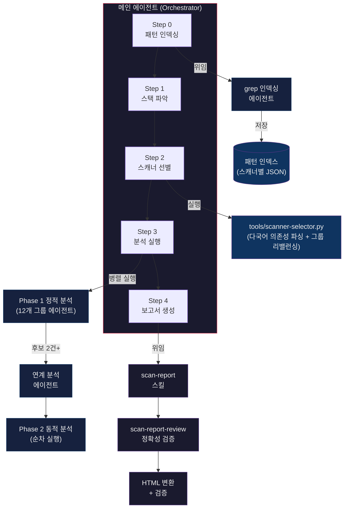
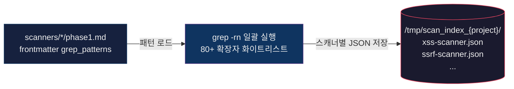
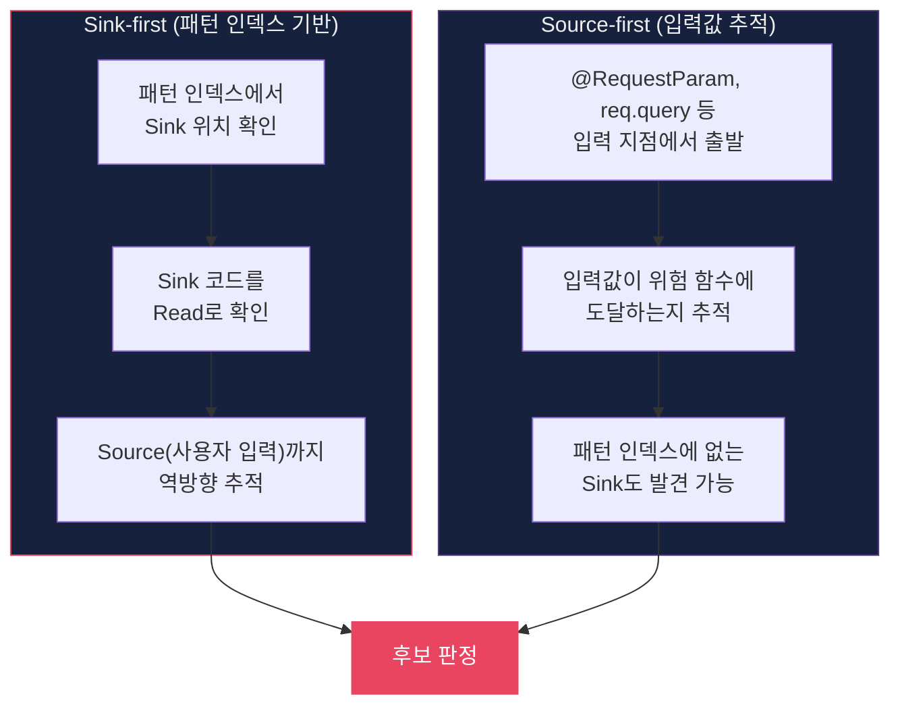
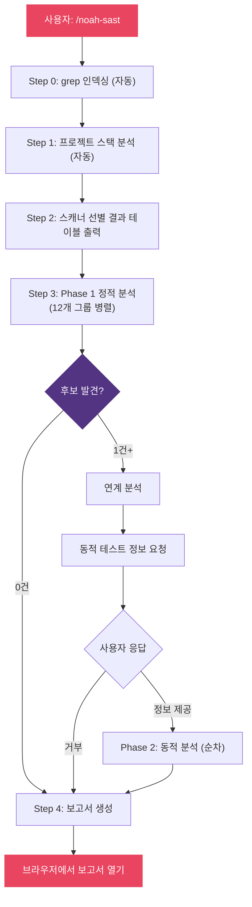

# Noah SAST

> Claude Code 스킬 기반의 자동화된 소스코드 취약점 분석 시스템.
> 37개 개별 스캐너를 오케스트레이션하여 정적 분석 → 연계 분석 → 동적 테스트 → 보고서 생성까지 수행합니다.

---

## 목차

- [개요](#개요)
- [아키텍처](#아키텍처)
- [실행 프로세스](#실행-프로세스)
- [스캐너 목록](#스캐너-목록)
- [개별 스캐너 구조](#개별-스캐너-구조)
- [분석 방법론](#분석-방법론)
- [보고서 파이프라인](#보고서-파이프라인)
- [사용법](#사용법)
- [디렉토리 구조](#디렉토리-구조)

---

## 개요

Noah SAST는 Claude Code의 **스킬(Skill)** 시스템 위에 구축된 통합 취약점 분석 프레임워크입니다.

| 설계 원칙 | 설명 |
|-----------|------|
| **중복 탐색 방지** | Step 0에서 모든 grep 패턴을 사전 인덱싱하여 개별 스캐너가 코드베이스를 중복 탐색하지 않음 |
| **병렬 실행** | 스캐너 그룹을 Agent 도구로 동시 실행 (grep 히트 수 기반 동적 리밸런싱) |
| **단일 진실 원천** | 후보 마스터 목록이 전체 프로세스의 유일한 상태 저장소 |
| **오탐 방지** | Sink-first + Source-first 병행 분석, 보고서 작성 후 소스코드 대조 검증 |
| **증분 분석** | `.noah-sast-cache/`에 grep 인덱스를 캐싱하여 변경된 파일만 재스캔 |
| **다국어 지원** | Node.js, Python, Ruby, Java 매니페스트에서 의존성을 파싱하여 정확한 스캐너 선별 |

**지원 범위:** Kotlin, Java, TypeScript, JavaScript, Python, Go, Ruby, PHP, C# 등 80+ 확장자. Spring Boot, React, Vue, Django, Express 등 주요 프레임워크의 보안 패턴 인식.

---

## 아키텍처

### 전체 흐름



---

## 실행 프로세스

### Step 0: 패턴 사전 인덱싱

개별 스캐너가 코드베이스를 중복 탐색하는 것을 방지하기 위해, **grep 인덱싱 에이전트**가 모든 패턴을 일괄 실행합니다.



**패턴 인덱스 파일 형식:**

```json
{
  "innerHTML": ["src/components/Comment.tsx:18", "src/components/Post.tsx:55"],
  "dangerouslySetInnerHTML": ["src/components/Comment.tsx:42"],
  "html_safe": []
}
```

- `파일경로:라인번호` 형식 (코드 내용 미포함)
- 히트 없는 패턴도 빈 배열로 포함
- 개별 스캐너 에이전트는 자신의 JSON 파일만 읽어 분석 시작

### Step 1: 프로젝트 스택 파악

모든 스캐너에 공통으로 필요한 프로젝트 정보를 파악합니다:

- `package.json`, `build.gradle.kts`, `requirements.txt` 등에서 프레임워크/언어 확인
- DB 종류 (MySQL, PostgreSQL, MongoDB, Redis 등)
- 인증 방식 (세션, JWT, OAuth, SAML 등)
- 프록시/CDN/로드밸런서 구조

### Step 2: 스캐너 선별

`tools/scanner-selector.py`가 grep 인덱스 + 프로젝트 아키텍처를 기반으로 자동 선별합니다.

```bash
python3 tools/scanner-selector.py <PATTERN_INDEX_DIR> <PROJECT_ROOT>
```

| 조건 | 판정 |
|------|------|
| grep 히트 1건 이상 | **반드시 포함** |
| grep 히트 0건 + 관련 라이브러리 존재 | 포함 |
| grep 히트 0건 + 관련 라이브러리 없음 | 제외 (사유 명시) |

> **기본 원칙: 포함이 기본이고, 제외에는 근거가 필요합니다.**

### Step 3: 분석 실행

3단계 분석 파이프라인으로 구성됩니다:

#### Phase 1: 정적 분석 (병렬)

선별된 스캐너를 의미적 연관성 기반 그룹으로 묶어 동시 실행합니다. `scanner-selector.py`가 grep 히트 수를 기반으로 과부하 그룹을 자동 분할합니다:

| 그룹 | 스캐너 |
|------|--------|
| url-navigation | xss, dom-xss, open-redirect |
| response-header | crlf-injection, host-header, http-method-tampering |
| db-query | sqli, nosqli |
| process-execution | command-injection, ssti |
| server-request | ssrf, pdf-generation |
| file-system | path-traversal, file-upload, zipslip |
| xml-serialization | xxe, xslt-injection, deserialization |
| auth-protocol | jwt, oauth, saml, csrf, idor |
| client-rendering | redos, css-injection, prototype-pollution |
| infra-config | http-smuggling, sourcemap, subdomain-takeover |
| data-export | csv-injection |
| protocol-check | graphql, websocket, soapaction-spoofing, ldap-injection |

각 그룹 에이전트의 분석 흐름:

1. `prompts/guidelines-phase1.md` (공통 지침) 읽기
2. 그룹 내 각 스캐너의 `phase1.md` 읽기
3. 패턴 인덱스 JSON 읽기
4. **Sink-first** + **Source-first** 병행 분석
5. 후보 목록을 `===SCANNER_BOUNDARY===` 구분자 + `[스캐너명]` 태그로 반환

#### Phase 2: 연계 분석

Phase 1 후보가 2건 이상이면 `chain-analysis` 스킬이 실행됩니다:

```
전제조건 매트릭스 → 연계 매트릭스 → 공격 체인 구성 → 테스트 시나리오 도출
```

#### Phase 3: 동적 분석 (Tier 기반 병렬화)

사용자가 테스트 환경 정보를 제공하면 실행됩니다:

- **Tier A** (인증 불요): security-headers, http-smuggling 등 → 다른 Tier와 병렬
- **Tier B** (공유 세션): xss, sqli, ssrf 등 주요 스캐너 → Tier 내 순차
- **Tier C** (독립 인증): oauth, saml, jwt → Tier B와 병렬
- 스캐너당 1 에이전트 원칙
- curl + Playwright(SPA/DOM XSS) 사용
- 결과: **확인됨** / **후보** / **안전** 최종 판정

### Step 4: 보고서 생성

`scan-report` 스킬이 통합 보고서를 생성합니다. 상세 흐름은 [보고서 파이프라인](#보고서-파이프라인) 참조.

---

## 스캐너 목록

### 37개 취약점 스캐너

| # | 스캐너 | 취약점 유형 | 그룹 |
|---|--------|-----------|------|
| 1 | xss-scanner | Cross-Site Scripting (Reflected/Stored) | url-navigation |
| 2 | dom-xss-scanner | DOM-based XSS | url-navigation |
| 3 | open-redirect-scanner | Open Redirect | url-navigation |
| 4 | crlf-injection-scanner | CRLF Injection / HTTP Response Splitting | response-header |
| 5 | host-header-scanner | Host Header Attack / IP Spoofing | response-header |
| 6 | http-method-tampering-scanner | HTTP Method Tampering | response-header |
| 7 | sqli-scanner | SQL Injection | db-query |
| 8 | nosqli-scanner | NoSQL Injection | db-query |
| 9 | command-injection-scanner | OS Command Injection | process-execution |
| 10 | ssti-scanner | Server-Side Template Injection | process-execution |
| 11 | ssrf-scanner | Server-Side Request Forgery | server-request |
| 12 | pdf-generation-scanner | PDF Generation SSRF/LFI | server-request |
| 13 | path-traversal-scanner | Path Traversal / LFI | file-system |
| 14 | file-upload-scanner | Unrestricted File Upload | file-system |
| 15 | zipslip-scanner | Zip Slip (Archive Path Traversal) | file-system |
| 16 | xxe-scanner | XML External Entity | xml-serialization |
| 17 | xslt-injection-scanner | XSLT Injection | xml-serialization |
| 18 | deserialization-scanner | Insecure Deserialization | xml-serialization |
| 19 | jwt-scanner | JWT Tampering | auth-protocol |
| 20 | oauth-scanner | OAuth Authentication Bypass | auth-protocol |
| 21 | saml-scanner | SAML Authentication Bypass | auth-protocol |
| 22 | csrf-scanner | Cross-Site Request Forgery | auth-protocol |
| 23 | idor-scanner | Insecure Direct Object Reference | auth-protocol |
| 24 | redos-scanner | Regular Expression DoS | client-rendering |
| 25 | css-injection-scanner | CSS Injection | client-rendering |
| 26 | prototype-pollution-scanner | Prototype Pollution | client-rendering |
| 27 | http-smuggling-scanner | HTTP Request Smuggling | infra-config |
| 28 | sourcemap-scanner | Source Map Exposure | infra-config |
| 29 | subdomain-takeover-scanner | Subdomain Takeover | infra-config |
| 30 | csv-injection-scanner | CSV / Formula Injection | data-export |
| 31 | graphql-scanner | GraphQL Vulnerabilities | protocol-check |
| 32 | websocket-scanner | WebSocket Vulnerabilities | protocol-check |
| 33 | soapaction-spoofing-scanner | SOAPAction Spoofing | protocol-check |
| 34 | ldap-injection-scanner | LDAP Injection | protocol-check |
| 35 | xpath-injection-scanner | XPath Injection | protocol-check |
| 36 | security-headers-scanner | Security Headers (CSP, CORS, HSTS 등) | infra-config |
| 37 | business-logic-scanner | Business Logic Vulnerabilities | business-logic |

---

## 개별 스캐너 구조

각 스캐너는 동일한 디렉토리 구조를 따릅니다:

```
noah-sast/scanners/{scanner-name}/
├── phase1.md      # 정적 분석 지침 (frontmatter grep_patterns + Sink 의미·판정·안전 패턴)
└── phase2.md      # 동적 테스트 지침 (테스트 절차, 도구, 스캐너별 확인됨 조건)
```

> grep 패턴은 각 스캐너의 `phase1.md` 최상단 YAML frontmatter (`grep_patterns:`)에 정의되어 있다. Step 0 grep 인덱싱 에이전트가 37개 phase1.md frontmatter를 직접 파싱하여 사용한다. 별도 통합 yml 파일은 없다.

### phase1.md 핵심 구조

```markdown
---
grep_patterns:
  - "innerHTML"
  - "dangerouslySetInnerHTML"
  - "\\.html\\s*\\("
  # ...
---

> ## 핵심 원칙: "..."

## Sink 의미론
## Source-first 추가 패턴
## 자주 놓치는 패턴 (Frequently Missed)
## 안전 패턴 카탈로그 (FP Guard)
## 후보 판정 의사결정
## 후보 판정 제한
```

---

## 분석 방법론

### Sink-first + Source-first 병행



### 판정 기준

| 판정 | 조건 |
|------|------|
| **후보** | Source→Sink 경로가 존재하고 중간에 검증/살균이 없음 |
| **안전** | 프레임워크 내장 방어, 명시적 sanitize, 타입 제약 등으로 방어됨 |
| **확인됨** | 동적 테스트에서 실제 트리거 확인 (코드 경로별 개별 증거 필요) |

---

## 보고서 파이프라인

보고서 생성은 `scan-report` 스킬이 담당하며, 5단계 파이프라인으로 구성됩니다.

| 단계 | 처리 | 담당 |
|------|------|------|
| Step 1 | 스켈레톤 작성 (헤더, 요약, 플레이스홀더) | 메인 에이전트 |
| Step 2 | 스캐너별 상세 섹션 병렬 작성 | 서브에이전트 |
| Step 3 | `assemble_report.py`로 MD 조립 + 요약 테이블 자동 생성 | Python 스크립트 |
| Step 4 | `scan-report-review`로 소스코드 대조 검증 → `md_to_html.py` HTML 변환 | 검증 에이전트 + 스크립트 |
| Step 5 | `validate_links.py` + `validate_report.py` 정량 검증 | Python 스크립트 |

### 보고서 출력물

| 파일 | 설명 |
|------|------|
| `noah-sast-report.md` | 마크다운 원본 |
| `noah-sast-report.html` | 브라우저용 HTML (단일 파일, 외부 의존성 없음) |

---

## 사용법

### 기본 실행

Claude Code에서 다음 중 하나를 입력합니다:

```
/noah-sast
sast
소스코드 취약점 스캔
```

### 실행 흐름



### 설치

`skills/noah-sast/` 디렉토리를 `~/.claude/skills/` 또는 프로젝트의 `.claude/skills/`에 복사합니다:

```bash
cp -r skills/noah-sast ~/.claude/skills/
```

---

## 디렉토리 구조

```
~/.claude/skills/noah-sast/
├── SKILL.md                          # 통합 오케스트레이터
│
├── prompts/                          # 서브 에이전트 지시 문서 (공통 지침 + 프롬프트)
│   ├── guidelines-phase1.md          # 정적 분석 공통 지침
│   ├── guidelines-phase2.md          # 동적 분석 공통 지침
│   ├── grep-agent.md                 # grep 인덱싱 에이전트 프롬프트
│   └── phase1-group-agent.md         # Phase 1 그룹 에이전트 프롬프트
│
├── scanners/                         # 37개 취약점 스캐너
│   ├── xss-scanner/
│   │   ├── phase1.md                 # 정적 분석 지침 (핵심 원칙 포함)
│   │   └── phase2.md                 # 동적 테스트 지침
│   ├── sqli-scanner/
│   └── ... (37개)
│
├── tools/                            # Python 유틸리티 스크립트
│   ├── scanner-selector.py           # 스캐너 선별 + 그룹 리밸런싱
│   ├── build-master-list.py          # Phase 1 결과 → master-list.json
│   ├── cache_manager.py              # grep 인덱스 증분 캐시
│   └── parse_phase1_output.py        # Phase 1 출력 파서
│
├── sub-skills/                       # SKILL.md 기반 서브스킬
│   ├── scan-report/                  # 보고서 작성
│   │   ├── SKILL.md
│   │   ├── assemble_report.py        # MD 조립
│   │   ├── md_to_html.py             # HTML 변환
│   │   ├── validate_links.py         # 앵커 링크 검증
│   │   ├── validate_report.py        # 정량 검증
│   │   └── vuln-format.md            # 취약점 상세 형식 템플릿
│   ├── scan-report-review/           # 보고서 정확성 검증
│   │   ├── SKILL.md
│   │   └── checklist.md
│   ├── chain-analysis/               # 연계 분석
│   │   ├── SKILL.md
│   │   └── chain-construction-rules.md
│   └── webapp-testing/               # Playwright 동적 테스트 도구
│       └── SKILL.md
│
└── tests/                            # grep 패턴 커버리지 테스트
    └── grep-coverage/
        ├── run_coverage.py
        └── fixtures/                 # 35개 스캐너별 must_hit.txt
```
