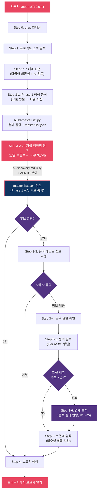

# noah-8719

> Claude Code 보안 분석 플러그인. 41개 취약점 스캐너 + AI 자율 탐색으로 정적 분석 + 동적 테스트 + 보고서 생성.

## 설치

```bash
git clone https://github.com/nomarlhack/noah-claude-plugin.git noah-8719
claude --plugin-dir ./noah-8719
```

#### 요구사항

| 항목 | 조건 |
|------|------|
| Claude Code | 최신 버전 |
| Git | 클론 시 필요 |
| Python 3 | 보고서 생성/검증 기능에 필요 |

#### 업데이트

```bash
cd noah-8719 && git pull
```

## 사용법

Claude Code에서 다음 중 하나를 입력합니다:

```
/noah-8719:sast
```

> `sast`, `소스코드 취약점 스캔` 등으로도 트리거됩니다.

## 실행 흐름



## 개요

Noah SAST는 Claude Code의 **스킬(Skill)** 시스템 위에 구축된 통합 취약점 분석 프레임워크입니다.

| 설계 원칙 | 설명 |
|-----------|------|
| **중복 탐색 방지** | Step 0에서 모든 grep 패턴을 사전 인덱싱하여 개별 스캐너가 코드베이스를 중복 탐색하지 않음 |
| **병렬 실행** | 스캐너 그룹을 Agent 도구로 동시 실행 (grep 히트 수 기반 동적 리밸런싱) |
| **단일 진실 원천** | `master-list.json` 파일이 전체 프로세스의 유일한 상태 저장소 |
| **오탐 방지** | Sink-first + Source-first 병행 분석, 보고서 작성 후 소스코드 대조 검증 |
| **다국어 지원** | Node.js, Python, Ruby, Java, Go 매니페스트에서 의존성을 파싱하여 스캐너 선별 |

## 스캐너 목록

| # | 스캐너 | 취약점 유형 | 그룹 |
|---|--------|-----------|------|
| 1 | xss-scanner | Cross-Site Scripting (Reflected/Stored) | url-navigation |
| 2 | dom-xss-scanner | DOM-based XSS | url-navigation |
| 3 | open-redirect-scanner | Open Redirect | url-navigation |
| 4 | crlf-injection-scanner | CRLF Injection / HTTP Response Splitting | response-header |
| 5 | host-header-scanner | Host Header Attack / IP Spoofing | response-header |
| 6 | http-method-tampering-scanner | HTTP Method Tampering | response-header |
| 7 | sqli-scanner | SQL Injection | db-query |
| 8 | nosqli-scanner | NoSQL Injection | db-query |
| 9 | command-injection-scanner | OS Command Injection | process-execution |
| 10 | ssti-scanner | Server-Side Template Injection | process-execution |
| 11 | ssrf-scanner | Server-Side Request Forgery | server-request |
| 12 | pdf-generation-scanner | PDF Generation SSRF/LFI | server-request |
| 13 | path-traversal-scanner | Path Traversal / LFI | file-system |
| 14 | file-upload-scanner | Unrestricted File Upload | file-system |
| 15 | zipslip-scanner | Zip Slip (Archive Path Traversal) | file-system |
| 16 | xxe-scanner | XML External Entity | xml-serialization |
| 17 | xslt-injection-scanner | XSLT Injection | xml-serialization |
| 18 | deserialization-scanner | Insecure Deserialization | xml-serialization |
| 19 | jwt-scanner | JWT Tampering | auth-protocol |
| 20 | oauth-scanner | OAuth Authentication Bypass | auth-protocol |
| 21 | saml-scanner | SAML Authentication Bypass | auth-protocol |
| 22 | csrf-scanner | Cross-Site Request Forgery | auth-protocol |
| 23 | idor-scanner | Insecure Direct Object Reference | auth-protocol |
| 24 | redos-scanner | Regular Expression DoS | client-rendering |
| 25 | css-injection-scanner | CSS Injection | client-rendering |
| 26 | prototype-pollution-scanner | Prototype Pollution | client-rendering |
| 27 | http-smuggling-scanner | HTTP Request Smuggling | infra-config |
| 28 | sourcemap-scanner | Source Map Exposure | infra-config |
| 29 | subdomain-takeover-scanner | Subdomain Takeover | infra-config |
| 30 | csv-injection-scanner | CSV / Formula Injection | data-export |
| 31 | graphql-scanner | GraphQL Vulnerabilities | protocol-check |
| 32 | websocket-scanner | WebSocket Vulnerabilities | protocol-check |
| 33 | soapaction-spoofing-scanner | SOAPAction Spoofing | protocol-check |
| 34 | ldap-injection-scanner | LDAP Injection | protocol-check |
| 35 | xpath-injection-scanner | XPath Injection | protocol-check |
| 36 | security-headers-scanner | Security Headers (CSP, CORS, HSTS 등) | infra-config |
| 37 | business-logic-scanner | Business Logic Vulnerabilities | business-logic |
| 38 | springboot-hardening-scanner | Spring Boot Hardening (설정 보안) | infra-config |
| 39 | cookie-security-scanner | Cookie Security (Secure, HttpOnly, Persistent 등) | auth-protocol |
| 40 | tls-scanner | TLS/SSL Misconfiguration | infra-config |
| 41 | validation-logic-scanner | Validation Logic Mismatch | business-logic |

## 디렉토리 구조

```
noah-8719/
├── .claude-plugin/
│   └── plugin.json                # 플러그인 매니페스트
├── hooks/
│   └── hooks.json                 # 보안 후크
├── skills/
│   └── sast/
│       ├── SKILL.md               # 오케스트레이터 (실행 프로세스 상세)
│       ├── scanners/              # 41개 취약점 스캐너 (각 phase1.md + phase2.md)
│       ├── prompts/               # 서브 에이전트 지시 문서
│       ├── tools/                 # Python 유틸리티 스크립트
│       ├── sub-skills/            # 내부 서브스킬
│       │   ├── scan-report/       # 보고서 생성
│       │   ├── scan-report-review/# 보고서 정확성 검증
│       │   └── chain-analysis/    # 공격 체인 연계 분석
│       └── tests/
├── install.sh
├── uninstall.sh
├── VERSION
├── LICENSE
└── README.md
```

## 상세 문서

| 문서 | 경로 | 내용 |
|------|------|------|
| 오케스트레이터 | `skills/sast/SKILL.md` | 전체 실행 프로세스 (Step 0~4), 스캐너 그룹 편성, 동적 분석 Tier, 결과 검증 |
| Phase 1 공통 지침 | `skills/sast/prompts/guidelines-phase1.md` | Sink-first + Source-first 분석, 래퍼 추적, 의미 기반 판정, Source 도달성 |
| Phase 2 공통 지침 | `skills/sast/prompts/guidelines-phase2.md` | 동적 테스트 절차, 에러 핸들링, 차단 응답 처리, 도메인 안전 규칙 |
| AI 자율 탐색 | `skills/sast/prompts/ai-discovery-agent.md` | 3단계 자율 탐색, 7개 제외 필터, Phase 1 충돌 해소 |
| 보고서 생성 | `skills/sast/sub-skills/scan-report/SKILL.md` | 스켈레톤 → 병렬 작성 → 조립 → HTML 변환 → 검증 |
| 보고서 리뷰 | `skills/sast/sub-skills/scan-report-review/SKILL.md` | 9항목 체크리스트, Source 도달성 검증, Spot-check, 이중 게이트 |
| 연계 분석 | `skills/sast/sub-skills/chain-analysis/SKILL.md` | R1~R5 체인 구성 규칙, 전제조건/연계 매트릭스 |
| 개별 스캐너 | `skills/sast/scanners/{name}/phase1.md` | Sink 의미론, 안전 패턴, 판정 의사결정, 자주 놓치는 패턴 |
