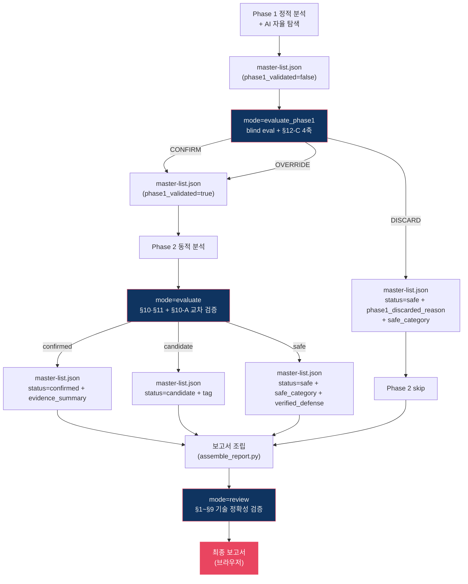

# 평가·리뷰 3모드 가이드

`scan-report-review` 서브스킬은 세 가지 모드로 동작한다. 각 모드는 호출 시점·입력·쓰기 대상·종료 조건이 다르다.

## 모드 요약

| 모드 | 호출 시점 | 주요 입력 | 쓰기 대상 | 핵심 역할 |
|------|----------|----------|----------|----------|
| `evaluate_phase1` | Phase 1 + AI 자율 탐색 완료 직후 | `PHASE1_RESULTS_DIR`, `master-list.json` | `evaluation/<scanner>-eval.md`, master-list의 `phase1_*` 필드 | Phase 1 결과 품질 검증. Phase 2 낭비 방지 |
| `evaluate` | Phase 2 동적 분석 완료 직후 | `PHASE1_RESULTS_DIR` (Phase 2 결과 포함), `master-list.json` | master-list의 `status`/`tag`/`evidence_summary`/`verified_defense`/`rederivation_performed`/`safe_category` | Phase 2 증거 기반 최종 status 할당 |
| `review` | 보고서 조립(`assemble_report.py`) 완료 직후 | 조립된 보고서 MD 파일, 프로젝트 루트 | 보고서 MD 파일 내용만 수정 | 보고서의 기술 정확성 검증 |

## 흐름도

---

## `mode=evaluate_phase1`

Phase 1이 생산한 후보 목록과 prose 분석의 **품질**을 독립 재판정한다. 판정 결과가 DISCARD면 Phase 2를 건너뛴다.

### 입력
- `PHASE1_RESULTS_DIR/<scanner>.md` — Phase 1 원본 (직접 참조는 C1 lint로 제한)
- `PHASE1_RESULTS_DIR/master-list.json` — 후보 메타데이터

### blind eval 절차
1. `tools/blind_read_phase1_md.py`로 Phase 1 MD 로드. `### Decision`·`### Confidence`·`### 판정 요약` 섹션이 `<MASKED>`로 치환된 뷰 반환.
2. 마스킹된 뷰만으로 §12-C 4축을 독립 적용:
   - §2 코드 스니펫 정확성 (파일·라인 존재)
   - §3 Source→Sink 흐름 (호출 관계, 중간 검증)
   - §4 부재 주장 검증 ("검증이 없다" 주장 확인)
   - §9 Source 도달성 (외부 HTTP 경로 존재 여부)
3. 마스킹 해제 → Phase 1 결론과 대조 → 3가지 판정 중 하나 선택.

### 판정 결과

| 판정 | 의미 | master-list.json 갱신 |
|------|------|---------------------|
| `CONFIRM` | Phase 1 판정 타당 | `phase1_validated: true` |
| `OVERRIDE` | Phase 1 판정에 수정 필요 (스니펫·흐름·부재 주장 오류) | `phase1_validated: true` + eval MD에 수정 권고 |
| `DISCARD` | §9 Source 도달성 ✗ 등 구조적 이유로 폐기 | `status: safe`, `phase1_validated: true`, `phase1_discarded_reason` 기록, `safe_category` enum 필수 명시 |

### 기록 파일
- `PHASE1_RESULTS_DIR/evaluation/<scanner>-eval.md` — 판정별 근거, 수정 권고, 품질 노트. 파일 상단에 `<!-- SOURCE_HASH: sha256:... -->` 기록.
- Phase 1 원본 `.md` 파일은 **절대 수정하지 않는다**.

### 재호출
- `phase1_eval_state.reopen=true`로 표시된 후보만 선택적으로 재호출.
- `retries` 카운터 상한 2. 초과 시 `requires_human_review=true`로 에스컬레이션.

---

## `mode=evaluate`

Phase 2 동적 분석이 생산한 evidence를 해석하여 각 후보의 최종 status를 확정한다.

### 입력
- `PHASE1_RESULTS_DIR/<scanner>-phase2.md` — 동적 테스트 실행 결과
- `PHASE1_RESULTS_DIR/evaluation/<scanner>-eval.md` — Phase 1 평가본
- `PHASE1_RESULTS_DIR/master-list.json` — Phase 1 후보 + evaluate_phase1 결과

### 판정 원칙 (§10·§11)
1. 동적 증거에서 **실제 트리거** 확인 → `confirmed`
2. 방어 계층 작동이 동적으로 입증됨 → `safe` + `safe_category: defense_verified` + `verified_defense`/`rederivation_performed` 기록
3. 테스트 미수행 / 결과 불확실 / 차단되었으나 방어 의도 미입증 → `candidate` + `tag` 필수

### 교차 검증 (§10-A)
Phase 2 결과가 Phase 1 주장과 모순되면 다음 중 하나를 수행:

| 상황 | 조치 |
|------|------|
| Phase 1은 취약 주장, Phase 2 evidence는 방어 작동 | `safe`로 확정하되 Phase 1의 오해석 라벨 기록 |
| Phase 1은 safe 주장, Phase 2에서 트리거 확인 | `phase1_eval_state.reopen=true` → evaluate_phase1 재호출 |
| 증거가 상호 모순적 | `requires_human_review=true` |

### master-list.json 갱신 필드

| 필드 | 값 |
|------|---|
| `status` | `confirmed` \| `candidate` \| `safe` |
| `tag` | candidate 전용. `정보 부족` \| `차단` \| `환경 제한` |
| `evidence_summary` | confirmed 전용 (재현 가능한 증거 요약) |
| `verified_defense` | safe + defense_verified 전용. `{file, lines, content_hash}` |
| `rederivation_performed` | safe + defense_verified 전용. Phase 1 이후 방어 코드 재확인 여부 |
| `safe_category` | safe 전용. enum 4분류 중 하나 필수 |

### DISCARD 보호
Phase 1에서 `phase1_discarded_reason != null`로 설정된 후보는 `mode=evaluate`가 status를 덮어쓰지 않는다. Phase 2 결과가 남아 있더라도 무시된다.

---

## `mode=review`

조립된 보고서 MD 파일의 **기술 정확성**을 검증한다. status는 이미 `mode=evaluate`에서 확정됐으므로 건드리지 않는다.

### 입력
- 조립된 보고서 MD (`noah-sast-report.md` 등)
- 프로젝트 루트 (코드 대조용)

### 검증 축 (checklist §1~§9)
- §1 확인됨·후보 항목 100% Read 대조
- §2 인용된 코드 스니펫이 실제 파일·라인에 존재
- §3 Source→Sink 흐름 호출 관계 확인
- §4 "검증 부재" 주장 재검증
- §5 취약점 유형 적합성
- §6 이상 없음 판정 근거 타당성
- §7 복수 요소 커버리지 (필요 시)
- §8 동일 file:line 다층 관점 통합
- §9 Source 도달성 재확인

### 조치 범위
- 오기재·사실 오류 → 보고서 MD **본문 수정**
- 치명적 오판정 (status 자체가 틀림) → 수정 금지. `mode=evaluate` 재호출을 통해 반영.

---

## Exit 코드

| 코드 | 의미 | 차단성 | 조치 |
|------|------|--------|------|
| `0` | pass | — | 다음 단계 진행 |
| `1` | incomplete / invalid state | Yes | 해당 모드 재호출 |
| `2` | human_review_block | Yes | `--accept-human-review=ID1,ID2` 명시 승인 필요 |
| `3` | rederivation_warn 등 비차단 경고 | No | 기록·모니터링만 |
| `4` | reopen_pending | Yes | `phase1_eval_state.reopen=true` 후보 존재 → `evaluate_phase1` 재호출 |
| `5` | lint 위반 (C1: Phase 1 원본 직접 참조) | Yes | `evaluation/*-eval.md`로 참조 전환 |
| `6` | missing_placeholder | Yes | 스켈레톤에 `<!-- SAFE_SECTION_HERE -->` 등 필수 플레이스홀더 누락 |
| `7` | safe_bucket_unclassified | Yes | safe 후보에 `safe_category` enum 누락. evaluate/evaluate_phase1이 기록해야 함 |

---

## AI 자율 탐색 후보의 취급

AI 자율 탐색이 발견한 후보(`AI-N` ID, `scanner=ai-discovery`)는 Phase 1 스캐너 후보와 **동일한 3모드 평가 대상**이다.

| 모드 | AI 후보 처리 |
|------|-------------|
| `evaluate_phase1` | `ai-discovery.md`를 원본으로 보고 `evaluation/ai-discovery-eval.md`에 판정 기록. §12-C 4축·blind eval 규약 동일 적용 |
| `evaluate` | 기존 스캐너 카테고리에 속하면 해당 Phase 2 결과 파일, 비카테고리(Race Condition·Mass Assignment 등)면 `ai-discovery-phase2.md`의 evidence로 status 할당 |
| `review` | 보고서의 `## AI 자율 탐색 결과` 섹션을 §1~§9 축으로 동일하게 검증 |

C1 lint(Phase 1 원본 직접 참조 금지)도 `ai-discovery.md`를 감시 대상에 포함한다. 다운스트림 소비자는 `evaluation/ai-discovery-eval.md`를 참조한다.

## 참고

- 상세 검증 축·스키마·Writer 권한 규약: `skills/sast/sub-skills/scan-report-review/checklist.md`
- 보고서 조립 로직: `skills/sast/sub-skills/scan-report/assemble_report.py`
- 오케스트레이션 Step 매핑: `skills/sast/SKILL.md` Step 3-2.5, 3-5.5, 4
