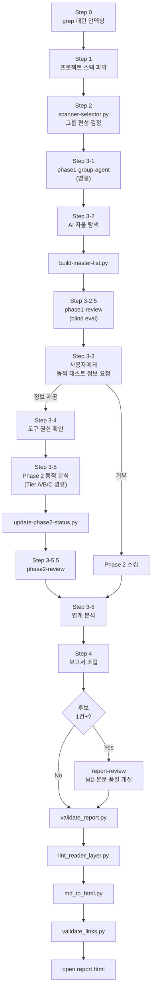
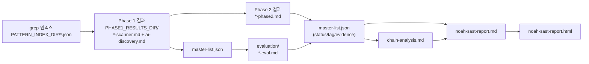

# 파이프라인 개요

Noah SAST 실행 단계를 한눈에 보여주는 문서. 각 Step의 상세 절차는 `SKILL.md`를 참조한다. 재개 경로는 `docs/resume.md`, 리뷰 3모드는 `docs/review-modes.md`.

## 전체 흐름

## 산출물 계보

## Tier 구조 (Step 3-5 Phase 2)

동적 분석은 인증 컨텍스트에 따라 Tier로 분류. Tier 간 병렬, Tier 내 순차.

| Tier | 특성 | 예시 스캐너 |
|------|------|-----------|
| A | 인증 불요 (헤더/설정) | security-headers, http-smuggling, tls |
| B | 공유 세션 사용 (주요 테스트) | xss, sqli, ssrf, idor, csrf 등 대부분 |
| C | 독립 인증 컨텍스트 | oauth, saml, jwt |

## 단일 진실 원천

| 대상 | 원천 | Writer |
|------|------|--------|
| 후보 메타데이터 | `master-list.json` | `build-master-list.py` (Phase 1 파싱) |
| Phase 1 판정 | `master-list.json`의 `phase1_*` 필드 | `phase1-review` |
| 최종 status | `master-list.json`의 `status/tag/evidence_summary` | `phase2-review` |
| Phase 2 증거 | `*-phase2.md`의 manifest v2 | Phase 2 에이전트 |
| 보고서 본문 | `noah-sast-report.md` | `assemble_report.py`, `report-review` |

상세 writer 권한은 `sub-skills/scan-report-review/_contracts.md` §1 참조.

## 관련 문서

| 문서 | 내용 |
|------|------|
| `SKILL.md` | Step별 실행 절차 (메인 에이전트용) |
| `docs/resume.md` | 중단 후 재개 판별 규칙 |
| `docs/review-modes.md` | phase1-review / phase2-review / report-review 3모드 |
| `docs/lint-reader-layer.md` | 독자 레이어 용어 lint 규칙 |
| `sub-skills/scan-report-review/_contracts.md` | Writer 권한 / Exit code / Schema |
| `sub-skills/scan-report-review/_principles.md` | Source 도달성 / 부재 주장 검증 원칙 |
