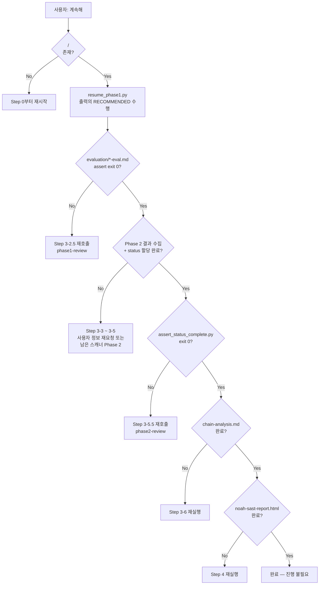

# 중단 후 재개 가이드

토큰 한도·반복 실패·에이전트 타임아웃 등으로 파이프라인이 중단된 뒤, 동일 세션에서 사용자가 "계속해" 같은 재개 요청을 보낼 때 적용하는 절차.

단계별 규칙은 `SKILL.md`에 산재해 있으므로 이 문서는 **통합 뷰**와 **재개 경로 판별 순서**를 제공한다.

---

## 단계별 재개 규칙 요약

| Step | 대상 | 완료 판별 기준 | 재개 동작 | 근거 |
|------|------|---------------|----------|------|
| 3-1 | Phase 1 정적 분석 | `resume_phase1.py`의 `SCANNERS.completed` | `RECOMMENDED` 순서대로 재dispatch. 에이전트는 유효 결과 파일 자동 스킵 (`phase1-group-agent.md` 절차 1) | SKILL.md Step 3-1 "중단 후 재개" |
| 3-2 | AI 자율 탐색 | `resume_phase1.py`의 `AI_DISCOVERY.status` (`exploration_status` 필드 근거) | `not_started` → dispatch. `incomplete` → continued 또는 merge. `complete` → 스킵. `invalid` → redispatch | SKILL.md Step 3-2 "중단 후 재개" |
| 3-2.5 | `phase1-review` | `assert_phase1_validated.py` exit 0 | exit 1 → `mode=phase1-review` 재호출 (idempotent) | SKILL.md Step 3-2.5 exit code 처리 |
| 3-5.5 | `phase2-review` | `assert_status_complete.py` exit 0 | exit 1 → 2회 재시도 → 실패 시 대기 → 재개 요청 시 재호출 | SKILL.md Step 3-5.5 "phase2-review 재시도 절차" |

**재개 판별의 진실 원천**: `tools/resume_phase1.py` — Step 3-1/3-2의 파일 시스템 상태를 단일 명령으로 요약한다. 메인 에이전트는 수동 판단 대신 이 스크립트 출력만 따른다.

**현재 재개 규칙이 명시되지 않은 단계** (gap):
- Step 3-5 (Phase 2 동적 분석) — 중단 시 완료된 `*-phase2.md` 파일과 마스터 목록의 Phase 2 미실행 후보를 대조하여 남은 스캐너만 재실행하는 절차가 SKILL.md에 명시되지 않음.
- Step 3-6 (연계 분석) — 중단 시 재실행 절차 명시 없음. 현재는 연계 분석 결과 파일 부재 시 전체 재실행이 암묵적.
- Step 4 (보고서 조립) — 조립 스크립트는 idempotent하지만 `report-review` 중단 시 재호출 규칙이 명시되지 않음.

> **Phase 1 범위 한정**: 토큰 한도는 경험적으로 Phase 1(정적 분석)에서 주로 발생하므로 `resume_phase1.py`는 Step 3-1/3-2만 커버한다. Step 3-5 이후의 재개 인프라는 필요 시 별도 구축.

---

## 재개 경로 판별 순서

메인 에이전트는 재개 요청을 받으면 아래 순서대로 산출물을 확인해 현재 위치를 특정한다.

---

## 산출물 체크리스트

재개 판별에 사용하는 파일·경로:

| 산출물 | 경로 | 검증 명령 |
|--------|------|-----------|
| Phase 1 예상 스캐너 | `<PHASE1_RESULTS_DIR>/_expected_scanners.json` | `cat` |
| Phase 1 결과 | `<PHASE1_RESULTS_DIR>/*-scanner.md` | `ls` |
| AI 자율 탐색 | `<PHASE1_RESULTS_DIR>/ai-discovery.md` | `ls` + manifest 파싱 |
| 마스터 목록 | `<PHASE1_RESULTS_DIR>/master-list.json` | `build-master-list.py` 재실행 |
| `phase1-review` | `<PHASE1_RESULTS_DIR>/evaluation/*-eval.md` | `assert_phase1_validated.py` |
| Phase 2 결과 | `<PHASE1_RESULTS_DIR>/*-phase2.md` | `update-phase2-status.py` |
| `phase2-review` | master-list.json의 `status`/`tag`/`safe_category` | `assert_status_complete.py` |
| 연계 분석 | `<PHASE1_RESULTS_DIR>/chain-analysis.md` | `ls` |
| 보고서 | 프로젝트 루트의 `noah-sast-report.html` | `validate_report.py` |

---

## 공통 원칙

- **변수 유지**: 동일 세션·동일 터미널 기준이므로 `NOAH_SAST_DIR` / `PATTERN_INDEX_DIR` / `PHASE1_RESULTS_DIR`는 컨텍스트에 남아 있다고 전제한다. 손실 시 `ls -dt /tmp/phase1_results_*_<basename>_*` 로 가장 최근 디렉토리를 후보로 제시.
- **결정론적 재실행**: `run_grep_index.py`, `scanner-selector.py`, `build-master-list.py`, `update-phase2-status.py`, `assemble_report.py`는 모두 idempotent. 재개 시 반복 실행해도 결과가 덮어쓰기만 된다.
- **Writer 권한 불변**: 재개 중에도 `sub-skills/scan-report-review/_contracts.md` §1 Writer Matrix를 위반하지 않는다. 특히 `phase1-review` 재호출이 `status` 필드를 건드리지 않도록 주의.
- **무한 루프 방지**: `phase2-review`는 2회 재시도 후 사용자 대기. `phase1_eval_state.retries` 상한 2 규칙(`_contracts.md` §3)이 `phase1-review` 재호출 루프를 차단.
